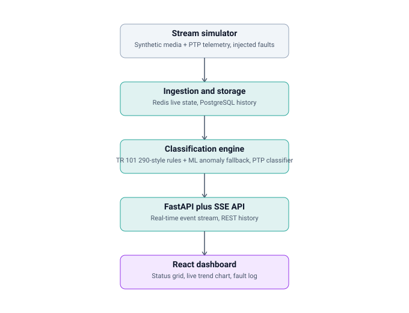

# IP broadcast signal health monitor

[](https://github.com/Paarth01/broadcast-signal-monitor/actions/workflows/ci.yml)

<!-- Replace YOUR-USERNAME above with your actual GitHub username once pushed. -->

A real-time monitoring dashboard for IP-based broadcast infrastructure. It
simulates a small SMPTE ST 2110-style facility (media essence streams plus a
PTP timing topology), classifies signal health using the same severity model
real broadcast monitoring equipment uses, and streams live status to a
console-style dashboard.

Built to demonstrate the intersection of software engineering and broadcast
engineering fundamentals: IP networking and signal transmission, equipment
health monitoring, and systems integration.

**30-second demo:** injecting a fault and watching it get classified live.

<video src="https://github.com/Paarth01/broadcast-signal-monitor/c98a42cf-cc5d-423a-93fe-c306a716417a" controls></video>


## Why it's modeled this way

Two design choices come directly from how broadcast engineers actually
monitor signal health, rather than from a generic "green/yellow/red"
dashboard:

**Priority 1 / 2 / 3 classification, not generic severity levels.**
ETSI TR 101 290, the DVB standard for transport stream monitoring, grades
every error into three priorities: Priority 1 errors break decodability
(sync loss, continuity count failures), Priority 2 errors impair quality
without breaking decodability (visible artifacts, intermittent decoding),
and Priority 3 errors are informational. This project doesn't parse real
MPEG-TS/RTP headers — there's no physical signal — but `media_classifier.py`
mirrors that exact three-tier reasoning against simulated packet loss,
jitter, and sequence-discontinuity telemetry.

**PTP synchronization is modeled as its own monitored category, not folded
into media health.** SMPTE ST 2059 mandates IEEE 1588 PTP for timing sync in
ST 2110 facilities, and real monitoring systems track PTP offset, mean path
delay, and master-election state per device, independently of the media
streams that depend on that timing. `ptp_classifier.py` and the PTP
simulator model a small grandmaster/slave topology with the two failure
modes that matter most in practice: gradual offset drift, and a rogue
device wrongly claiming the master role.

## Architecture



## The ML anomaly layer, and its honest limits

Beyond the fixed-threshold rules, `soft_drift` is a fault mode that stays
just under every rule threshold at once (e.g. jitter 1.5-1.95ms *and*
packet loss 0.4-0.95%, when Priority 3 alone needs jitter ≥2ms and
Priority 2 needs loss ≥1%) — a combination the fixed-threshold classifier
can never catch by construction. An IsolationForest trained on the
simulator's own telemetry distribution catches some of this via
`app/ml/model.py`.

This is deliberately not oversold: the threshold is calibrated for a
~0.4% false-positive rate on healthy telemetry, which caps the catch rate
at roughly 15-20% of soft-drift cases (see the tradeoff table in
`app/ml/train.py`). A noisy monitoring dashboard is worse than one that
occasionally misses subtle drift, so recall was traded for precision. This
is a real, common tradeoff in anomaly detection, not a bug — raising
`ANOMALY_SCORE_THRESHOLD` trades it back the other way if the priority
shifts.

## Tech stack

- **Backend**: FastAPI, SQLAlchemy, PostgreSQL, Redis, Server-Sent Events, scikit-learn
- **Frontend**: React, TypeScript, Vite, Chart.js
- **Infra**: Docker Compose, GitHub Actions CI

## Running it

### With Docker (full stack)

```bash
docker compose up --build
```

- Dashboard: http://localhost:5173
- API: http://localhost:8000/api/streams
- API docs: http://localhost:8000/docs

### Without Docker (quick local run)

The backend runs standalone with zero external services — it falls back to
a local SQLite file and an in-process state store if `DATABASE_URL` /
`REDIS_URL` aren't set.

```bash
# backend
cd backend
pip install -r requirements.txt
uvicorn app.main:app --reload

# frontend, in a second terminal
cd frontend
npm install
npm run dev
```

Then open http://localhost:5173.

## Demo: injecting a fault

The dashboard has buttons to inject faults live (packet loss, jitter spike,
full dropout, PTP drift, rogue PTP master, and `soft_drift` — the ML-only
case described above) so the detection pipeline can be demonstrated
without real broadcast hardware. You can also call the API directly:

```bash
curl -X POST http://localhost:8000/api/simulate/fault \
  -H "Content-Type: application/json" \
  -d '{"stream_name": "ob-van-uplink", "fault_type": "dropout", "duration_seconds": 15}'
```

Watch the stream's status tile flip to Priority 1, the live trend chart
move, and the event appear in the fault log within a second.

## Tests

```bash
cd backend
pytest -v
```

22 tests: classification logic (rules + ML), and API integration tests
that exercise the real simulator → classifier → database → API path end
to end, not just isolated units.

## CI

GitHub Actions (`.github/workflows/ci.yml`) runs three jobs on every push/PR:

- **backend**: retrains the anomaly model from scratch and runs the full pytest suite
- **frontend**: TypeScript check plus a production build
- **docker-compose**: actually runs `docker compose up --build`, waits for the
  backend to become healthy, verifies streams are being simulated and
  classified, injects a live fault and confirms it flows through to
  Priority 1 and the fault log, and confirms the frontend serves and
  proxies `/api` through nginx correctly. This exists specifically because
  the Docker path can't be exercised in every development environment —
  CI is the source of truth for "does `docker compose up` actually work."

## Retraining the anomaly model

```bash
cd backend
python -m app.ml.train
```

A trained `model.joblib` is committed to the repo so the app runs out of
the box, but it's fully reproducible (fixed random seed) — CI retrains it
from scratch on every run rather than trusting the committed binary.

## What's simulated vs. real

Everything here is a software simulation — there's no real ST 2110 network,
no real RTP packets, no real PTP hardware. The goal is to model the
*reasoning* broadcast monitoring systems use (severity classification,
timing-health as a distinct concern, fault history) on top of a real,
working software stack, not to reimplement broadcast protocols from
scratch.

## Possible extensions

- NMOS IS-04/IS-05-style device discovery instead of a static device list
- Downsampling/aggregation for the history endpoint if metric volume grows
  large in a long-running deployment (currently returns raw recent rows)
